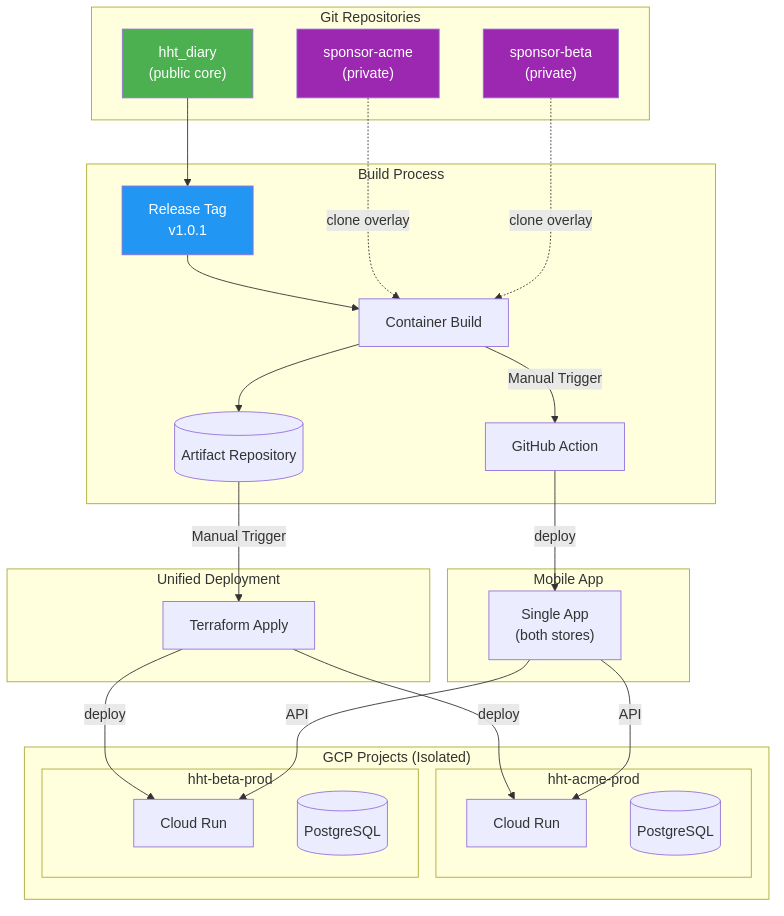
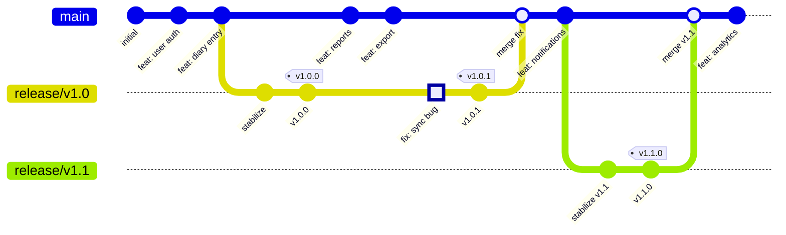

# Branching Strategy (Recommended)

## Executive Summary
This document defines a **trunk-based development** strategy optimized for FDA-compliant clinical trials with multi-sponsor deployments. It prioritizes simplicity, scalability, and correct git usage.

**Core Principles:**
- Tags for releases (immutable references)
- Branches converge (no permanent parallel branches)
- Deployment is infrastructure (not git branches)
- Merge, don't cherry-pick (traceability)

---

## Repository Architecture
A multi-repository architecture (also known as "polyrepo") is a software development strategy where different projects, components, or microservices are housed in separate, independent repositories. This approach emphasizes autonomy and isolation for individual teams and components.
### Product Repository
```
hht_diary (PUBLIC - core repo)
├── apps/                    # Flutter app templates
├── apps/common-dart/        # Shared Dart packages
├── database/                # PostgreSQL schema, migrations
├── terraform/               # Infrastructure-as-code
├── sponsor/                 # Sponsor-specific code stubs
└── tools/                   # Build, validation, plugins
```
### Sponsor Repository(s)
```
sponsor-{name} (PRIVATE - per sponsor)
├── config/                  # Environment overrides
├── branding/                # Logos, themes, strings
└── portal/                  # EDC bridge application (optional)
```

### Why This Structure?
**Single core repo with deployment (not separate):**
- One system = one deployment = one repo
- Code and terraform often change together (atomic commits)
- Tags give immutable references without repo sprawl
- A separate deployment repo would add coordination overhead without benefit

**Private sponsor repos (polyrepos not monorepo):**
- Sponsors need private access to their configuration
- Config may reveal sponsor identity (even with codenames)
- Portal apps may have sponsor-specific business logic
- Build process clones sponsor repos as overlays

### Unified Deployment Model
All sponsors are deployed **together** from a single release tag:

```yaml
# sponsors.yaml
system:
  release_tag: v1.0.1  # ALL sponsors get this version

sponsors:
  acme-pharma:
    sponsor_repo: git@github.com:cure-hht/sponsor-acme.git
    gcp_project: hht-acme-prod
    locked: true  # Study active - approval required for updates

  betacorp:
    sponsor_repo: git@github.com:cure-hht/sponsor-betacorp.git
    gcp_project: hht-betacorp-prod
    locked: false  # Can receive updates freely
```

This means:
- **One release, many deployments**: Same code deployed to isolated GCP projects
- **Sponsor repos as config overlays**: Cloned at build time, not separate branches
- **Locked studies**: Gate on approval, not on version freezing



---

## Branch Types
```
main                          # Single source of truth
├── feature/CUR-xxx-desc      # New features (short-lived, days)
├── fix/CUR-xxx-desc          # Bug fixes (short-lived, hours-days)
├── release/v1.x              # Stabilization only (short-lived, 1-2 weeks)
└── doc/CUR-xxx-desc          # Documentation (short-lived, days)
```

## Versions & Tagging
We practice the industry standard [Semantic Versioning](https://semver.org/spec/v1.0.0.html).
Tags are the primary mechanism for identifying deployable versions.

```
v1.0.0                        # Production release
v1.0.0+fc4a409                # Developer's commit SHA
v1.0.1                        # Hotfix release
v1.0.0-rc.1                   # Release candidate (pre-release)
v1.0.0-beta.1                 # Beta release
mobile-v2.1.0                 # Mobile app release
mobile-v2.1.0+6d6ee33         # Mobile with commit SHA
```

### Why Tags, Not Branches?

| Tags | Long-lived Branches |
| --- | --- |
| Immutable (can't be changed) | Mutable (anyone can push) |
| Zero maintenance | Must apply fixes to each branch |
| Clear history | Parallel histories diverge |
| Scales to any number | More sponsors = more branches |
| Git's intended use for releases | Anti-pattern for releases |

---

### Branch Lifecycle

| Branch Type | Created From | Merges To | Lifetime | Deleted After |
| --- | --- | --- | --- | --- |
| `feature/*` | `main` | `main` via PR | days < week | Merge |
| `fix/*` | `main` or `release/*` | `main` and `release/*` | hours-days | Merge |
| `release/*` | `main` | N/A (tag and delete) | 1-2 weeks | Merge, Final tag |
| `doc/*` | `main` | `main` | days < week | Merge |

**Note:** Release branches are for **QA, stabilization only**. Once tagged, they are merged and deleted.



---

## Workflow Examples

### 1. Features

```bash
# 1. Create feature branch from main
git checkout main && git pull
git checkout -b feature/CUR-450-medication-tracking

# 2. Develop and commit
git commit -m "feat(CUR-450): Add medication data model"
git commit -m "feat(CUR-450): Implement medication entry UI"

# 3. Push and create PR
git push -u origin feature/CUR-450-medication-tracking
gh pr create --base main

# 4. After review, squash merge to main
# Branch auto-deleted after merge
```

### 2. Releases

```bash
# 1. Create release branch for stabilization
git checkout main && git pull
git checkout -b release/v1.0
git push -u origin release/v1.0

# 2. Tag release candidates
git tag -a v1.0.0-rc.1 -m "v1.0.0 Release Candidate 1"
git push origin v1.0.0-rc.1

# 2. Only bug fixes allowed on release branch
# Feature freeze in effect

# 4. After QA approval, tag final release
git tag -a v1.0.0 -m "v1.0.0 - Production release for Q1 2026"
git push origin v1.0.0

# 5. DELETE the release branch (tag preserves reference)
git checkout main
git branch -d release/v1.0
git push origin --delete release/v1.0
```

### 3. Patches

```bash
# 1. Create fix branch from the release TAG (not a branch)
git checkout -b fix/CUR-475-critical-sync-bug v1.0.0

# 2. Fix the issue
git commit -m "fix(CUR-475): Resolve data sync race condition"
git push -u origin fix/CUR-475-critical-sync-bug

# 3. Create PR to main
gh pr create --base main

# 4. After merge to main, tag the new patch release
git checkout main && git pull
git tag -a v1.0.1 -m "v1.0.1 - Critical sync fix"
git push origin v1.0.1

# 5. Delete fix branch
git branch -d fix/CUR-475-critical-sync-bug
git push origin --delete fix/CUR-475-critical-sync-bug
```

### 4. Incremental Release (v1.1)

```bash
# Later development adds new features to main
# When ready for v1.1:

git checkout main && git pull
git checkout -b release/v1.1
# ... stabilization ...
git tag -a v1.1.0 -m "v1.1.0 - Enhanced reporting features"
git push origin v1.1.0
git checkout main
git branch -d release/v1.1
git push origin --delete release/v1.1

# Now we have tags: v1.0.0, v1.0.1, v1.1.0
# No permanent branches cluttering the repo
```

---

## Sponsor Deployments (Unified Model)

**Key insight**: We have ONE SYSTEM. All sponsors run the same version.

```yaml
# sponsors.yaml - unified deployment config
system:
  release_tag: v1.0.1  # ALL sponsors deploy this tag

sponsors:
  acme-pharma:
    sponsor_repo: git@github.com:cure-hht/sponsor-acme.git
    gcp_project: hht-acme-prod
    locked: true   # Active study - approval gate

  betacorp:
    sponsor_repo: git@github.com:cure-hht/sponsor-betacorp.git
    gcp_project: hht-betacorp-prod
    locked: false  # Can receive updates freely
```

### Deployment Process

```bash
deploy_all() {
  tag=$(yq ".system.release_tag" sponsors.yaml)

  # Checkout the release tag
  git checkout "tags/${tag}"

  # Deploy to each sponsor's isolated GCP project
  for sponsor in $(yq ".sponsors | keys | .[]" sponsors.yaml); do
    # Skip template entries
    [[ "$sponsor" == _* ]] && continue

    # Clone sponsor's private repo as overlay
    sponsor_repo=$(yq ".sponsors.${sponsor}.sponsor_repo" sponsors.yaml)
    git clone "${sponsor_repo}" "/tmp/sponsor-${sponsor}"

    # Apply sponsor overlay (config, branding)
    cp -r "/tmp/sponsor-${sponsor}/config/"* config/
    cp -r "/tmp/sponsor-${sponsor}/branding/"* assets/

    # Deploy to sponsor's GCP project
    gcp_project=$(yq ".sponsors.${sponsor}.gcp_project" sponsors.yaml)
    terraform apply -var="project=${gcp_project}" -var="sponsor=${sponsor}"
  done
}
```

### Locked Studies

For sponsors in active clinical trials (`locked: true`):
- Same code version as everyone else
- **Approval gate** prevents accidental deployments
- CI/CD checks `locked` flag before deploying

```bash
# In CI/CD pipeline
if yq ".sponsors.${sponsor}.locked" sponsors.yaml | grep -q true; then
  if [[ -z "$DEPLOYMENT_APPROVAL" ]]; then
    echo "ERROR: Sponsor ${sponsor} is locked. Set DEPLOYMENT_APPROVAL=yes"
    exit 1
  fi
fi
```

---

## Hotfixes

Since all sponsors run the same version, hotfixes go to everyone:

```bash
# 1. Create fix from main (or from the current tag if urgent)
git checkout main && git pull
git checkout -b fix/CUR-500-critical-bug

# 2. Fix the issue
git commit -m "fix(CUR-500): Resolve critical issue"

# 3. Merge to main
gh pr create --base main
# After approval:
git checkout main && git merge fix/CUR-500-critical-bug
git push origin main

# 4. Tag the release from main
git checkout main
git tag -a v1.0.2 -m "v1.0.2 - Critical fix for CUR-500"
git push origin v1.0.2

# 5. Update system config to use new tag
# sponsors.yaml: system.release_tag: v1.0.2

# 6. Deploy (all sponsors get the fix)
./deploy.sh  # Deploys v1.0.2 to all sponsors

# 7. Cleanup
git branch -d fix/CUR-500-critical-bug
```

**Benefits of unified versioning:**
- Fix goes to everyone (no sponsor left behind on buggy version)
- No cherry-picking or multi-branch maintenance
- Clear audit trail (one tag = one system state)

---

## Mobile App Strategy

Since all backends run the same version, the mobile app is simpler:

### Single Backend Version

```dart
class ApiClient {
  Future<void> connect(String backendUrl) async {
    // All backends run same version - just verify compatibility
    final version = await _getBackendVersion(backendUrl);

    if (version.major != expectedMajor) {
      throw IncompatibleVersionException(
        "App requires backend v${expectedMajor}.x, got ${version}"
      );
    }

    // No version-specific adapters needed
    _adapter = ApiAdapter();
  }
}
```

**Why simpler?** All sponsors run the same backend version, so the app only needs to be compatible with ONE backend version at a time.

### Mobile Releases

```bash
# Mobile follows same pattern as backend
git checkout main && git pull
git checkout -b release/mobile-v2.1
# ... stabilize ...
git tag -a mobile-v2.1.0 -m "Mobile v2.1.0 - Requires backend v1.0.x"
git push origin mobile-v2.1.0
# Delete branch after tagging
```

### Compatibility (Simplified)

Since all backends run the same version, compatibility is straightforward:

```yaml
# sponsors.yaml
system:
  release_tag: v1.0.2       # Backend version
  mobile_tag: mobile-v2.1.0 # Mobile version (must be compatible)

# Mobile v2.1.x is built for backend v1.0.x
# When upgrading to v1.1.x, also release compatible mobile version
```

**Release coordination:**
- Backend and mobile are separate release tracks
- But all sponsors run same backend, so only ONE compatibility check
- Major backend upgrade → verify mobile compatibility → coordinate releases

---

## Branch Protection Rules

### `main` Branch
- Require pull request reviews (minimum 1)
- Require status checks to pass (CI, tests)
- Require linear history (squash merges)
- No direct pushes

### `release/*` Branches
- Require pull request reviews (minimum 1)
- Require status checks to pass
- Only `fix/*` branches can merge
- Auto-delete when tagged

### Tag Protection
- Only CI/CD or release managers can push tags
- Tags cannot be deleted or force-pushed

---

## Comparison: This Strategy vs Original Proposal

| Aspect | This Strategy | Original Proposal |
| --- | --- | --- |
| Release references | Tags (immutable) | Long-lived branches (mutable) |
| Sponsor deployments | Infrastructure config | Sponsor branches |
| Hotfix workflow | Merge to main, then tag | Cherry-pick back to main |
| Branches over time | Constant (converge/delete) | Growing (never deleted) |
| Maintenance burden | Low | Scales with sponsors |
| Git best practices | Follows | Violates |

---

## Quick Reference

### Branch Commands

```bash
# Feature
git checkout main && git pull && git checkout -b feature/CUR-xxx-desc

# Fix
git checkout main && git pull && git checkout -b fix/CUR-xxx-desc

# Hotfix for old version
git checkout -b fix/CUR-xxx-hotfix v1.0.1
```

### Tag Commands

```bash
# Release
git tag -a v1.x.0 -m "v1.x.0 - Description"

# Release candidate
git tag -a v1.x.0-rc.1 -m "v1.x.0 RC1"

# Mobile
git tag -a mobile-v2.x.0 -m "Mobile v2.x.0"

# Push tags
git push origin --tags
```

### Deploy Commands

```bash
# Update sponsor version
yq -i '.sponsors.acme-pharma.release_tag = "v1.0.2"' sponsors.yaml

# Deploy
./deploy.sh acme-pharma
```

---

*Document Version: 1.0.0*
*Last Updated: 2026-01-08*
